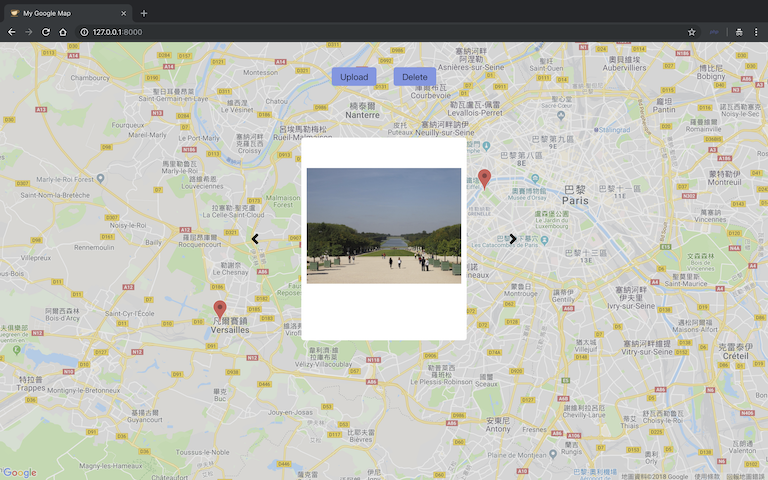

Google Map Photo
===========================
<a href="https://youtu.be/6GwlfX6fTrE"></a>  
### [Demo vedio click here](https://youtu.be/6GwlfX6fTrE).

### Operation
Add Marker : double click  
Remove Marker : right click

## Before The Project

- [Get a google map javascript api key](https://cloud.google.com/maps-platform).
- [Get a aws user key](https://console.aws.amazon.com/iam/home#/home).
- [Create a aws s3 bucket](https://s3.console.aws.amazon.com/s3/home).
- Don't forget git the user key permission for s3

## .env setting
```
DB_CONNECTION=mysql
DB_HOST=127.0.0.1
DB_PORT=3306
DB_DATABASE=YOUR_DB_NAME
DB_USERNAME=YOUR_DB_USER_NAME
DB_PASSWORD=YOUR_DB_PASSWORD

AWS_ACCESS_KEY_ID=YOUR_AWS_USER_KEY_ID
AWS_SECRET_ACCESS_KEY=YOUR_AWS_USER_KEY
AWS_DEFAULT_REGION=YOUR_AWS_S3_REGION
AWS_BUCKET=YOUR_AWS_S3_BUCKET_NAME

GOOGLE_MAP_KEY=YOUR_GOOGLE_MAP_API_KEY
```

## Run command

1. DB migrate : ``` php artisan migrate ```

2. Install npm package : ``` npm install ```

3. Run laravel mix : ``` npm run production ```

